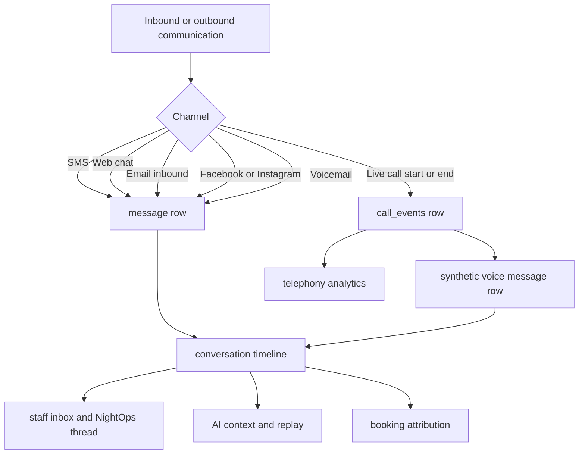

# ServicePro v3 Unified Communications Hub Audit and Build Plan

## Executive summary

Enabled connector used for this audit: **GitHub**.

I audited the `cleanmachinetulsa/ServicePro_v3` repository with a repo-first lens focused on the communications stack: conversations/messages, Twilio voice, voicemail, AI message tooling, A2P/10DLC, tenant isolation, inbox UI, and tests. The core conclusion is strong: **ServicePro already has the correct foundational data shape to become a real Unified Communications Hub**, because customer interactions are already centered around tenant-scoped conversations plus message metadata, and voice activity already resolves into tenant-scoped conversations through `call_events` and voicemail sync flows. The biggest remaining issue is not “missing communications infrastructure” in the broad sense. It is that **live calls still live beside the message timeline instead of inside it**, so the product is not yet telling the full truth when it presents a “unified inbox.” fileciteturn43file0 fileciteturn49file0 fileciteturn50file0

The other major correction is about 10DLC. ServicePro does **not** need a brand-new 10DLC system from scratch. It already has meaningful A2P scaffolding: a tenant route surface for campaign setup, a TrustHub service, a sender guard, consent keyword handling, and Twilio status callbacks. But the current TrustHub implementation is **partially simulated**, including placeholder SIDs and simulated status progression in `refreshCampaignStatus()`. So the right next step is **not** “build 10DLC infrastructure from zero,” and it is also **not** “assume 10DLC is fully production-complete.” The right next step is a **Deliverability Operations Layer** on top of what exists, plus a targeted hardening pass to replace or clearly isolate simulated pieces before scaling traffic. fileciteturn44file0 fileciteturn45file0 fileciteturn46file0

My recommendation is a staged plan:

- **Stage 1:** make voice first-class in the communication timeline on the backend.
- **Stage 2:** render that unified timeline in the UI and make call/message actions feel like one workflow.
- **Stage 3:** finish channel parity and operational observability, including SendGrid inbound email threading, social-composer parity, and 10DLC deliverability ops.
- **Stage 4:** add advanced telephony capabilities, especially browser softphone and live AI voice, only after the timeline is truly unified.

That sequencing minimizes duplicate work, respects what is already built, and keeps the product aligned with the niche strategy you described: one platform that understands **calls, texts, voicemails, bookings, and AI context together** for mobile service businesses. fileciteturn49file0 fileciteturn50file0 fileciteturn55file0 fileciteturn58file0

## Repo-grounded architecture audit

### Messaging core

ServicePro’s messaging center is built on a strong tenant-scoped primitive set. `shared/schema.ts` defines `conversations` with customer identity, platform, intent, control mode, assignment, status, escalation flags, `behaviorSettings`, `threadId`, and timestamps; it also defines `messages` with sender, channel, status fields, attachments, metadata JSON, timestamps, and `phoneLineId`. `call_events` already references `conversations`, which is exactly the kind of relational shape you want for a unified communications hub. fileciteturn39file0 fileciteturn40file0

The core service layer is reusable and should not be rebuilt. `server/conversationService.ts` already handles list/query operations, conversation creation, thread linking, and `addMessage()` with metadata and `phoneLineId`. That means the cleanest path to voice unification is to **extend this existing message pipeline** rather than inventing a new parallel “timeline item” system. fileciteturn37file0 fileciteturn38file0

`server/routes.conversations.ts` confirms the inbox/conversation APIs are centered on `messages`, not on a merged “messages + calls” abstraction. Its thread summary endpoint reads recent rows from `messages` only, and its channel-switch endpoint creates or finds sibling conversations by platform. That is one of the clearest signals that live call records still sit outside the timeline the staff actually reads. fileciteturn76file0 fileciteturn41file0 fileciteturn42file0

### Voice core

The voice foundation is substantial and worth extending, not replacing. `server/routes.twilioVoiceCanonical.ts` provides the canonical inbound voice entry point with central tenant routing, telephony modes, IVR mode branching, and AI-voice branching. `shared/schema.ts` shows that `tenant_phone_config` already stores voice-relevant configuration such as `phoneNumber`, `messagingServiceSid`, SIP settings, `ivrMode`, `telephonyMode`, forwarding number, and ring duration. fileciteturn55file0 fileciteturn56file0 fileciteturn57file0 fileciteturn92file0

`server/callLoggingService.ts` is the key backend asset for the next stage. It already resolves or creates the correct conversation based on customer phone number and writes a tenant-scoped `call_events` row tied to that conversation. That means the repo already knows how to associate a live call with the right conversation; what it does **not** do yet is also write a corresponding `messages` row for the thread UI. In other words, the unification gap is mostly an **event persistence gap**, not an identity-model gap. fileciteturn49file0

Voicemail is much closer to the target design than live calling is. `server/services/voicemailConversationService.ts` takes voicemail payloads, resolves or creates a conversation, writes a message with `metadata.type = 'voicemail'`, and can also append an AI follow-up message. `server/routes.twilioVoiceIvr.ts` sends missed-call SMS, syncs voicemails into conversations, and handles voicemail transcription callbacks. The product already demonstrates, in production code, the exact pattern you want for live call events: **turn communication artifacts into message timeline rows with rich metadata**. fileciteturn50file0 fileciteturn48file0

The AI voice route exists, but the service behind it is still a placeholder. `server/routes.twilioVoiceAi.ts` gates and routes AI voice calls, while `server/services/aiVoiceSession.ts` explicitly says it currently returns static placeholder TwiML and is intended for future streaming AI integration. The corresponding test file verifies placeholder TwiML generation, not real-time streaming, transcription, or tool invocation. That means AI voice is **not** missing conceptually, but it is absolutely still incomplete as a product capability. fileciteturn52file0 fileciteturn54file0 fileciteturn87file0

### AI pipeline and replayability

The AI observability work is real and reusable. `server/services/aiToolMetadata.ts` captures tool calls per conversation and exposes a take/drain API. `server/routes.aiReplay.ts` shows the replay surface is role-gated, tenant-scoped, and built by reading AI-message metadata such as tool calls, tool call details, model output, and final sent text. On the frontend, `client/src/components/messages/MessageBubble.tsx` renders AI tool pills from message metadata, which is exactly the right extension mechanism for future voice-derived summaries or call-intent artifacts. fileciteturn84file0 fileciteturn29file0 fileciteturn73file0

One important design implication follows from those files: if live call summaries are persisted as rich `messages.metadata` payloads, then the existing replay, pill, and moderation infrastructure can stay conceptually consistent. You do **not** need a separate “voice replay system” for stage one. You need to persist voice events in a shape that the existing AI/inbox stack can understand. That is a major cost saver and a major anti-duplication win. This is an inference, but it is strongly supported by the current metadata-driven message architecture. fileciteturn38file0 fileciteturn50file0 fileciteturn84file0 fileciteturn73file0

### Tenant safety, auth, and operational boundaries

The tenant-safety story is materially better than average for a product at this stage. `server/tenantDb.ts` centralizes tenant wrapping and tenant filters. `server/authMiddleware.ts` populates user/tenant context, and `server/rbacMiddleware.ts` contains role-aware authorization helpers. `server/routes.aiReplay.ts` is a good example of how these layers are applied in practice to keep sensitive AI traces tenant-scoped and role-restricted. This architecture should be treated as foundational and reused everywhere in the next stages. fileciteturn31file0 fileciteturn30file0 fileciteturn28file0 fileciteturn29file0

The safest rule for the next implementation phase is simple: **every voice-to-message write path should enter through tenant-resolved server code and should not create any new cross-tenant lookup shortcuts**. The repo already has the patterns needed to do that correctly. fileciteturn55file0 fileciteturn49file0 fileciteturn31file0

## What to reuse, what to extend, and what not to rebuild

### Reuse and extend

The following components are already strong enough to serve as the spine of the Unified Communications Hub:

| Area | Exact files found | Current behavior | Guidance |
|---|---|---|---|
| Conversation/message primitives | `shared/schema.ts`, `server/conversationService.ts` | Canonical tenant-scoped conversations and messages, plus metadata-rich `addMessage()` flow. fileciteturn39file0 fileciteturn38file0 | **Reuse directly.** Extend with synthetic voice messages instead of inventing a new timeline store. |
| Voice-to-conversation identity mapping | `server/callLoggingService.ts` | Resolves a conversation by customer phone and logs `call_events` against it. fileciteturn49file0 | **Extend.** Add message persistence beside call-event logging. |
| Voicemail timeline pattern | `server/services/voicemailConversationService.ts`, `server/routes.twilioVoiceIvr.ts` | Syncs voicemail into `messages` with rich metadata and marks human attention. fileciteturn50file0 fileciteturn48file0 | **Copy this pattern** for completed live calls and missed-call artifacts. |
| Canonical Twilio voice entry | `server/routes.twilioVoiceCanonical.ts`, `shared/schema.ts` | Centralized tenant routing, telephony mode branching, AI-voice routing, SIP forwarding. fileciteturn55file0 fileciteturn56file0 fileciteturn92file0 | **Reuse.** Do not fork inbound voice routing into a second system. |
| AI metadata/replay surface | `server/services/aiToolMetadata.ts`, `server/routes.aiReplay.ts`, `client/src/components/messages/MessageBubble.tsx` | Persisted metadata powers replay and visible AI pills. fileciteturn84file0 fileciteturn29file0 fileciteturn73file0 | **Reuse.** Voice summaries and call AI actions should land in message metadata. |
| Existing inbox shell | `client/src/components/messages/NightOpsThreadView.tsx`, `client/src/components/ThreadView.tsx`, `client/src/components/messages/MessageBubble.tsx` | Strong foundation for a unified thread experience, including channel switching and voicemail presentation. fileciteturn68file0 fileciteturn70file0 fileciteturn73file0 | **Extend.** Add call cards and call/message action affordances here, not in a separate “phone inbox.” |

### Avoid and do not rebuild

Do **not** rebuild any of the following from scratch:

- Do not create a second communication timeline store outside `conversations` + `messages`. The schema and services already support metadata-rich timeline rows. fileciteturn39file0 fileciteturn38file0
- Do not create a second voice routing entry point. `routes.twilioVoiceCanonical.ts` is already the canonical inbound route. fileciteturn55file0 fileciteturn57file0
- Do not replace voicemail sync with a bespoke voice-message system. It is already the right pattern. fileciteturn50file0
- Do not build a brand-new 10DLC settings area. Extend the existing A2P route/service/page surface instead. `server/routes.a2pCampaign.ts` already owns that domain. fileciteturn44file0
- Do not invent a second tenant-authorization model. Keep using `tenantDb`, `requireAuth`, and role middleware. fileciteturn31file0 fileciteturn30file0 fileciteturn28file0
- Do not bolt on a separate “AI trace for calls” UI until synthetic voice messages are in the thread. The message metadata/replay model already exists. fileciteturn84file0 fileciteturn29file0

### The main blind spots and partially implemented pieces

The most important gaps are these:

- **Live calls are conversation-linked but not message-timeline-native.** `callLoggingService.ts` writes `call_events`; voicemail sync writes `messages`; that mismatch is the central architectural gap. fileciteturn49file0 fileciteturn50file0
- **AI voice is routed but still placeholder-only.** The current service returns static TwiML and the tests validate placeholder messaging rather than real-time streaming behavior. fileciteturn52file0 fileciteturn54file0 fileciteturn87file0
- **Unified composer parity is incomplete for social handoff.** The inbox UI supports a “switch channel” action, but the backend currently blocks Facebook/Instagram replies on that path with a clear “not yet supported” error. fileciteturn68file0 fileciteturn41file0 fileciteturn42file0
- **Outbound email exists, but inbound email-thread unification is not present in the files reviewed.** The repo has campaign/outbound email routes and a SendGrid event webhook for delivery/open/bounce handling, but the webhook reviewed is not an inbound Parse webhook that creates conversation messages. fileciteturn79file0 fileciteturn78file0
- **The phone UI is still bifurcated.** `Dialer.tsx` either opens `tel:` on mobile or uses click-to-call on desktop, while the inbox remains a text-first surface. That is useful, but it is not yet a single communication workspace. fileciteturn63file0 fileciteturn64file0 fileciteturn66file0

## The most important correction on 10DLC

### What exists today

ServicePro clearly already contains A2P/10DLC code paths:

- `server/routes.a2pCampaign.ts` exposes tenant endpoints for current state, validation, AI suggestion, submit, refresh, resubmit, and phone SMS status. fileciteturn44file0
- `server/services/a2pTrustHubService.ts` contains brand/customer-profile/campaign workflow methods and a phone-status helper. fileciteturn45file0
- `server/services/smsSendGuard.ts` blocks unsafe sender situations and checks messaging-service configuration. fileciteturn46file0
- `server/services/smsConsentKeywords.ts` handles STOP/START/HELP logic before AI routing, which is important operationally even though some copy remains root-tenant flavored. fileciteturn47file0
- `server/routes.twilioStatusCallback.ts` writes delivery status, error codes, and timestamps back into message/campaign tracking. fileciteturn26file0 fileciteturn27file0

### What is missing or still too soft

The important repo-grounded nuance is that the TrustHub layer is not yet fully “real-world complete.” In `server/services/a2pTrustHubService.ts`, `ensureBrandForTenant()` creates placeholder SIDs like `BU${Date.now().toString(36)}` and `CP${Date.now().toString(36)}`, and `refreshCampaignStatus()` explicitly simulates status progression locally if enough time passes. That means part of the current A2P lifecycle is still acting like a functional scaffold rather than a full live-mode integration. fileciteturn45file0

So the correct 10DLC position is:

| Question | Repo-grounded answer |
|---|---|
| Do you need to build a whole new 10DLC system? | **No.** There is already meaningful A2P route/service/guard/callback infrastructure. fileciteturn44file0 fileciteturn45file0 fileciteturn46file0 |
| Is the current A2P implementation fully production-finished? | **Also no.** Parts of the TrustHub workflow are still simulated or placeholder-based. fileciteturn45file0 |
| What should be done next? | Build a **Deliverability Operations Layer** on the current A2P surface, and harden the simulated flows before depending on them at scale. fileciteturn44file0 fileciteturn45file0 fileciteturn26file0 |

### Recommended 10DLC Deliverability Operations Layer

The right implementation is a focused operational layer, not a brand-new subsystem:

| Gap | Extend existing file | Add |
|---|---|---|
| No owner-facing aggregated deliverability picture | `client/src/pages/SettingsA2P.tsx`, `server/routes.a2pCampaign.ts`, `server/routes.twilioStatusCallback.ts` | 24h/7d send, delivered, undelivered, carrier-filtered, top error codes, campaign status health. fileciteturn44file0 fileciteturn26file0 |
| No proactive filter/throttle alerting | `server/routes.twilioStatusCallback.ts`, existing alert/push infrastructure already registered in routes | Threshold-based owner alert when filter/error spikes occur. fileciteturn26file0 fileciteturn43file0 |
| No throughput-aware pacing | `server/services/smsSendGuard.ts` | Per-tenant MPS pacing and queued bulk-send bursts. The current guard is sender/config-centric, not pacing-centric. fileciteturn46file0 |
| No sample-message drift monitoring | Reuse `server/routes.a2pCampaign.ts` plus outbound campaign/message logs | Weekly drift sampler comparing registered sample types to outbound bodies. fileciteturn44file0 |
| Simulated TrustHub state not clearly separated from live state | `server/services/a2pTrustHubService.ts` | “simulation mode” flag, explicit UI badge, and live-mode upgrade checklist before customer rollout. fileciteturn45file0 |

## Staged build plan

### Event model target



This is the model the repo is already approaching. Voicemail already follows it. Live calling does not yet. fileciteturn50file0 fileciteturn49file0

### Stage one

**Objective:** make voice truly timeline-native on the backend without inventing any new communication model.

**Primary files to change:**

- `server/callLoggingService.ts`
- `server/conversationService.ts`
- `server/routes.calls.ts`
- `server/routes.twilioVoiceIvr.ts`
- `server/routes.conversations.ts`
- `shared/schema.ts` only if an additive provenance field is required
- new small helper service such as `server/services/voiceTimelineService.ts`
- tests under `server/tests/`

**What to implement:**

1. When a call is created or completed, write a **synthetic `messages` row** into the same conversation using `addMessage()`. Use `channel: 'voice'` in metadata, not a brand-new table. Include `callSid`, direction, duration, status, recording URL if any, transcription if any, `callEventId`, and AI summary/priority if available. The body text can be human-readable, for example “Inbound call · 9m 14s · answered” while the structured truth remains in metadata. This mirrors the voicemail pattern already in production. fileciteturn49file0 fileciteturn50file0 fileciteturn38file0

2. Update any server paths that finalize calls so that the synthetic message is written exactly once per important call lifecycle event, with idempotency by `callSid + eventType`. The goal is to avoid duplicate rows when Twilio status callbacks retry. This should be implemented as a small shared helper, not copy-pasted into multiple voice routes. The repo already demonstrates callback-heavy Twilio flows, so idempotency is mandatory. fileciteturn48file0 fileciteturn26file0

3. Add **call-to-booking provenance**. The safest minimal route is one additive nullable appointment field such as `sourceCallSid` plus an index, **only if no existing appointment attribution field already covers this after a local repo search**. Do not add a table unless the codebase proves one is needed. The appointment schema excerpt I inspected does not currently expose a call-source field. fileciteturn91file0

4. Feed synthetic voice messages into any AI context builders that currently read messages only, so that the next AI SMS/web reply can see “customer called 11 minutes ago about X.” That should happen through the existing conversation/message pipeline rather than a special-case telephony memory mechanism. This is an inference-based recommendation grounded in how summaries and replays already work off message history. fileciteturn76file0 fileciteturn84file0 fileciteturn73file0

**Schema guidance:** prefer **no schema change** for timeline unification itself. Use `messages.metadata`. Add only a safe nullable booking provenance column if operationally necessary. fileciteturn38file0 fileciteturn91file0

**Acceptance criteria:**

- A completed live call appears in the thread without needing a separate phone page.
- The thread summary endpoint can reflect recent call activity because the call is now represented in `messages`.
- Call rows are tenant-safe and idempotent.
- A booking created from a recent call can be linked back to `callSid`.
- No destructive migration. No duplicate voice timeline store. fileciteturn49file0 fileciteturn50file0 fileciteturn76file0

### Stage two

**Objective:** make the unified model visible and efficient to use in the UI.

**Primary files to change:**

- `client/src/components/ThreadView.tsx`
- `client/src/components/messages/MessageBubble.tsx`
- `client/src/components/messages/NightOpsThreadView.tsx`
- `client/src/components/messages/Composer.tsx`
- `client/src/components/phone/Dialer.tsx`
- possibly `client/src/pages/messages.tsx`

**What to implement:**

1. Add a **Voice Call Card** render path for message rows whose metadata indicates `channel: 'voice'` or `type: 'call'`. Keep using `MessageBubble.tsx` extension style rather than building a separate thread renderer. Voicemail already has a specialized render pattern in this component. fileciteturn72file0 fileciteturn73file0

2. Add inline call affordances in the thread header/composer area so staff can call or message from the same context without switching mental models. The composer is currently message-centric and the dialer is a separate UI. Stage two should not yet build WebRTC; it should just make the current call initiation feel integrated. fileciteturn63file0 fileciteturn66file0

3. Add an **AI replay deep-link** on AI-originated messages and, where appropriate, on AI-generated voice summaries so suspicious or important automation can be inspected from the inbox. The replay route exists already. fileciteturn29file0 fileciteturn73file0

4. Add a callback/call-request owner surface if those artifacts are already being recorded during handoff logic. This closes the loop between escalation artifacts and the inbox UX. I did not re-open the callback service file in this pass, so that item should be validated during implementation before branching UI work. fileciteturn85file3

**Acceptance criteria:**

- Staff can read calls, voicemails, and texts in one thread.
- Staff can initiate a call from the thread context and stay oriented.
- AI-originated communication has replay visibility from the thread UI.
- No separate “shadow inbox” is introduced. fileciteturn68file0 fileciteturn70file0 fileciteturn73file0

### Stage three

**Objective:** complete channel parity and communications operations.

**Primary files to change:**

- `server/routes.sendgridWebhook.ts` or a new dedicated inbound parse route
- `server/routes.email.ts`
- `server/routes.conversations.ts`
- `server/routes.facebook.ts`
- `server/routes.a2pCampaign.ts`
- `server/services/a2pTrustHubService.ts`
- `server/services/smsSendGuard.ts`
- `server/routes.twilioStatusCallback.ts`
- existing A2P settings UI page

**What to implement:**

1. Add **inbound email threading** via SendGrid inbound Parse or equivalent. The current SendGrid webhook reviewed is event-oriented, not reply-thread-oriented. fileciteturn78file0

2. Add **Facebook/Instagram outbound parity** to the unified channel-switch/composer path using the existing `routes.facebook.ts` plumbing rather than leaving that backend route blocked. The codebase already knows how to send via the Graph API when properly configured. fileciteturn41file0 fileciteturn42file0 fileciteturn82file0

3. Ship the **10DLC Deliverability Operations Layer** described above on top of the existing A2P stack, and clearly separate simulated TrustHub mode from live mode. fileciteturn44file0 fileciteturn45file0 fileciteturn46file0

### Stage four

**Objective:** add advanced telephony only after the timeline and ops model are solid.

**Primary files to change:**

- `server/services/aiVoiceSession.ts`
- `server/routes.twilioVoiceAi.ts`
- new WebRTC/browser-voice routes and frontend components
- `client/src/components/phone/*`
- usage metering surfaces and tests

**What to implement:**

1. Replace placeholder AI voice TwiML with a real streaming voice session only after the rest of the timeline is trustworthy. The current service is explicitly still placeholder-only. fileciteturn54file0

2. Introduce browser softphone/WebRTC as an **optional** operator mode, not as a rushed replacement for the existing bridge plus mobile `tel:` flow. Today’s outbound modes are functional: mobile devices use `tel:`/Groundwire interception and desktop uses click-to-call. Those should remain as fallbacks even after WebRTC. fileciteturn63file0 fileciteturn64file0 fileciteturn59file0

### Outbound call mode recommendation

| Mode | Repo evidence | Pros | Limits | Recommendation |
|---|---|---|---|---|
| Current Twilio bridge | Desktop `Dialer.tsx` posts to `/api/calls/initiate`; server calls business phone first, then bridges to customer. fileciteturn63file0 fileciteturn59file0 | Already works, low build risk, no browser audio complexity | Feels indirect, weaker for teams | **Keep for now** as stable baseline |
| Current mobile `tel:` fallback | Mobile dialer opens `tel:` and expects Groundwire/native interception. fileciteturn63file0 | Excellent road-warrior practicality | Less in-app control and observability | **Keep permanently** as supported fallback |
| SIP-based routing | `tenant_phone_config` already stores SIP domain/username; canonical voice route can dial SIP. fileciteturn92file0 fileciteturn56file0 | Good for advanced shops/softphone apps | More setup complexity | **Preserve**, don’t expand first |
| Browser WebRTC softphone | Not present in audited code | Best fully unified operator UX | Highest frontend and permission complexity | **Stage four**, optional, not day-one requirement |

## Drop-in Replit prompts

### Stage one prompt

The prompt below is grounded in the repo’s current conversation/message, voicemail, and call-event architecture. It is designed to push the agent toward extending existing systems instead of inventing new ones. Relevant audited files include `server/conversationService.ts`, `server/callLoggingService.ts`, `server/services/voicemailConversationService.ts`, `server/routes.calls.ts`, `server/routes.twilioVoiceIvr.ts`, `server/routes.conversations.ts`, and `shared/schema.ts`. fileciteturn38file0 fileciteturn49file0 fileciteturn50file0 fileciteturn59file0 fileciteturn76file0 fileciteturn39file0

```text
You are editing the ServicePro v3 repository.

Goal:
Implement Stage One of the Unified Communications Hub by making live voice calls first-class timeline events inside existing tenant-scoped conversations, without creating a second communications system.

Critical guardrails:
- SEARCH BEFORE CREATE.
- First read replit.md and inspect the existing implementations in:
  - server/conversationService.ts
  - server/callLoggingService.ts
  - server/services/voicemailConversationService.ts
  - server/routes.calls.ts
  - server/routes.twilioVoiceIvr.ts
  - server/routes.conversations.ts
  - shared/schema.ts
- Reuse existing conversation/message primitives and tenant isolation patterns.
- Do NOT create a new timeline table if existing conversations/messages + metadata can support the feature.
- Do NOT create destructive migrations.
- Do NOT weaken tenant isolation.
- Do NOT duplicate Twilio routing or voicemail sync logic.
- Batch work efficiently. Make the smallest safe set of changes that produces a shippable result.
- Prefer additive helpers over copy-paste changes across routes.
- Add or update tests for all new behavior.
- If any required data already exists in schema, reuse it rather than adding columns.

What to build:
1. Voice-as-message persistence
- When a live call is initiated, answered, completed, missed, or otherwise finalized in a meaningful way, persist a synthetic message row into the same conversation used by call_events.
- Use the existing addMessage flow if possible.
- The human-readable message content can be something like:
  - “Inbound call started”
  - “Inbound call completed · 9m 14s”
  - “Outbound call completed · no answer”
- Store structured truth in message.metadata, including at minimum:
  - type: "call"
  - channel: "voice"
  - callSid
  - callEventId if available
  - direction
  - from
  - to
  - status
  - duration
  - recordingUrl if available
  - transcriptionText if available
  - aiSummary if available
  - aiPriority if available
- Keep this tenant-scoped and idempotent.

2. Idempotency and dedupe
- A Twilio callback retry must not create duplicate synthetic call messages.
- Implement a small shared helper, for example server/services/voiceTimelineService.ts, rather than scattering duplicate logic.
- Use a deterministic idempotency key based on callSid + event type or finalization type.
- Reuse existing message metadata patterns wherever possible.

3. Conversation timeline compatibility
- Ensure that existing conversation APIs and thread summary logic can naturally include voice events because they are now persisted as messages.
- Do not fork the thread summary endpoint into a separate voice path unless absolutely necessary.
- If a tiny read-side enhancement is needed, keep it minimal and well-typed.

4. Booking provenance
- Search shared/schema.ts and appointment-related server code for any existing booking attribution field.
- If no safe existing field covers call attribution, add one SAFE additive nullable field on appointments (for example sourceCallSid) with a Drizzle migration.
- No destructive changes.
- Automatically populate provenance when a booking is created from a recent call context if the repo already has a clear booking creation path. If that exact linkage is too risky for this pass, create the safest server-side hook possible and document the remaining limitation.

5. AI memory compatibility
- If the AI context builder for SMS/web replies only reads messages, ensure the newly created synthetic call messages are usable as part of that memory.
- Do not create a second AI memory store for voice.
- Reuse metadata-driven patterns.

Tests required:
- Unit tests for the new voice timeline helper
- Idempotency test proving duplicate callback input does not duplicate message rows
- Integration-style test or dry-run test showing:
  - call event resolves to conversation
  - synthetic message is created
  - message metadata contains callSid and voice type
- If a migration is added, include sane validation and rollback-safe design

Output requirements:
- Provide a completion summary with:
  - exact files changed
  - whether a migration was added
  - how to test
  - any env vars required
  - any limitations left for Stage Two
- If you find an existing reusable function or helper, explicitly name it in the summary so we know duplication was avoided.

Success criteria:
- A completed/missed live call appears in the existing conversation timeline as a message-backed artifact
- No second timeline system exists
- No tenant leakage
- No destructive schema changes
- Tests pass
```

### Stage two prompt

This prompt is grounded in the existing thread UI and phone surfaces: `client/src/components/messages/MessageBubble.tsx`, `client/src/components/messages/NightOpsThreadView.tsx`, `client/src/components/ThreadView.tsx`, `client/src/components/phone/Dialer.tsx`, and `client/src/components/phone/ActiveCall.tsx`. It assumes Stage One has already landed synthetic voice messages into the thread. fileciteturn70file0 fileciteturn72file0 fileciteturn73file0 fileciteturn68file0 fileciteturn63file0 fileciteturn66file0

```text
You are editing the ServicePro v3 repository.

Goal:
Implement Stage Two of the Unified Communications Hub by integrating voice call artifacts and call actions directly into the existing thread UI so staff can call and message from one coherent workspace.

Critical guardrails:
- SEARCH BEFORE CREATE.
- First inspect:
  - client/src/components/messages/MessageBubble.tsx
  - client/src/components/messages/NightOpsThreadView.tsx
  - client/src/components/ThreadView.tsx
  - client/src/components/messages/Composer.tsx
  - client/src/components/phone/Dialer.tsx
  - client/src/components/phone/ActiveCall.tsx
  - any relevant messages page file
- Reuse the existing message bubble and thread architecture.
- Do NOT create a separate phone inbox.
- Do NOT break voicemail rendering.
- Do NOT force a WebRTC/browser-softphone build in this stage.
- Keep tenant-safe and role-safe behavior intact.
- Batch changes efficiently and avoid expensive trial-and-error loops.

What to build:
1. Voice Call Card rendering
- Extend the existing thread/message rendering so synthetic voice messages from Stage One display as polished call cards.
- The card should clearly show:
  - inbound/outbound
  - call status
  - duration if available
  - timestamp
  - recording/transcript/summary affordances if present in metadata
- Reuse the voicemail styling philosophy already in MessageBubble where possible.

2. Unified call/message actions
- Add thread-level actions so an agent can:
  - call the customer
  - continue messaging
  - stay oriented in the same conversation context
- Use the current call initiation path for now.
- Do not introduce WebRTC in this stage.
- The UX should feel like one communication workspace, not two tools glued together.

3. AI trace access
- If the message is AI-generated and a replay route exists, add a clean deep-link to AI replay from the relevant bubble or thread action surface.
- Keep it role-safe and non-intrusive.

4. Callback and follow-up visibility
- If callback request or call-related artifacts already exist in the conversation metadata or related server APIs, surface them in-context in the thread or adjacent panel.
- Search before creating any new API.
- Prefer lightweight thread-level surfaces over a brand-new dashboard page unless the existing APIs make that impossible.

5. Polish and accessibility
- The call card UI must look native to the existing design system.
- Maintain responsive behavior on mobile and desktop.
- Preserve current voicemail audio playback behavior.
- Add test IDs for key interactions.

Tests required:
- Component tests or focused UI tests for:
  - rendering a voice call card
  - rendering voicemail unchanged
  - thread-level call action presence
  - AI replay link visibility only when appropriate
- If no formal test harness exists for these components, add the smallest reasonable test coverage and document manual QA steps.

Output requirements:
- Provide a completion summary with:
  - exact files changed
  - UX decisions made
  - how to test manually
  - any pieces intentionally deferred to Stage Three or Four
- Explicitly confirm that you reused existing message/thread components instead of building a parallel communications surface.

Success criteria:
- The conversation thread visibly includes live-call artifacts in a polished way
- Staff can initiate a call from the thread context
- Voicemail still works
- No second inbox or second thread renderer was introduced
- Tests or focused QA hooks are in place
```

## Broader platform implications beyond the messaging slice

Even though this pass was communication-focused, the repo structure already suggests a product with many capable but somewhat feature-local surfaces: dedicated phone components, dedicated A2P settings, dedicated Facebook routes/settings, email campaign routes, AI replay, public status/demo flows, and a large central route registry. That is a sign of product maturity, but it also implies that **onboarding and settings information architecture** will matter a great deal before broad commercial rollout. I did not do a full-platform UX architecture audit here, so I am not presenting a definitive IA redesign. I am saying this communications work should be implemented in a way that **reduces** future fragmentation rather than increasing it. fileciteturn43file0 fileciteturn44file0 fileciteturn79file0 fileciteturn81file0

The most practical product rule for the next months is this: whenever a new communication feature is added, its first question should be, “Does this strengthen the single customer timeline and single operator workspace?” If the answer is no, it is likely creating future UX debt. That principle matches the repo’s strongest current assets and avoids the “bolted together” feeling you explicitly want to prevent. This is a design recommendation, but it follows directly from the current split between a strong conversation core and several partially separate comms surfaces. fileciteturn38file0 fileciteturn49file0 fileciteturn63file0 fileciteturn68file0

## Open questions and limitations

A few items remain open because I did not inspect every relevant file or because the connector pass could not efficiently expose every exact schema segment:

- I did **not** verify the exact `a2pCampaigns` table definition line-by-line in `shared/schema.ts`, although the route/service layer clearly imports and uses it. The A2P audit above is grounded in the route and service code I did read. fileciteturn44file0 fileciteturn45file0
- I reviewed SendGrid event webhook handling, but I did **not** find an inbound email Parse thread-ingestion flow in the files inspected. If one exists elsewhere, it should be discovered before building that stage. fileciteturn78file0 fileciteturn79file0
- Facebook/Instagram plumbing exists, but you already stated the credentials/connectors may not yet be fully configured in your environment. The build plan should proceed anyway, but rollout of social parity depends on those credentials and page/app setup. fileciteturn81file0 fileciteturn82file0
- The recommended default outbound call strategy is to keep the current Twilio bridge plus mobile `tel:` fallback while the unified timeline ships; browser WebRTC should be a later opt-in enhancement unless you explicitly want to make softphone-first behavior a product decision. fileciteturn59file0 fileciteturn63file0
- I did not perform a full-platform settings/onboarding UX inventory in this pass, so broader IA recommendations are directional rather than exhaustive. fileciteturn43file0

## Completion summary

### Files read

I directly read or partially read the following repo files during this audit:

- `server/routes.ts`
- `shared/schema.ts`
- `server/conversationService.ts`
- `server/routes.conversations.ts`
- `server/callLoggingService.ts`
- `server/services/voicemailConversationService.ts`
- `server/routes.twilioVoiceIvr.ts`
- `server/routes.twilioVoiceCanonical.ts`
- `server/routes.twilioVoiceAi.ts`
- `server/services/aiVoiceSession.ts`
- `server/routes.calls.ts`
- `client/src/components/phone/Dialer.tsx`
- `client/src/components/phone/ActiveCall.tsx`
- `client/src/components/messages/NightOpsThreadView.tsx`
- `client/src/components/messages/MessageBubble.tsx`
- `server/routes.aiReplay.ts`
- `server/services/aiToolMetadata.ts`
- `server/authMiddleware.ts`
- `server/rbacMiddleware.ts`
- `server/tenantDb.ts`
- `server/routes.a2pCampaign.ts`
- `server/services/a2pTrustHubService.ts`
- `server/services/smsSendGuard.ts`
- `server/services/smsConsentKeywords.ts`
- `server/routes.twilioStatusCallback.ts`
- `server/routes.sendgridWebhook.ts`
- `server/routes.email.ts`
- `server/routes.facebook.ts`
- `server/tests/audit_t3_premiumPlays.test.ts`
- `server/tests/aiVoiceSession.test.ts` fileciteturn43file0 fileciteturn49file0 fileciteturn50file0 fileciteturn55file0 fileciteturn58file0 fileciteturn63file0 fileciteturn66file0 fileciteturn68file0 fileciteturn70file0 fileciteturn29file0 fileciteturn84file0 fileciteturn31file0 fileciteturn44file0 fileciteturn45file0 fileciteturn46file0 fileciteturn26file0 fileciteturn78file0 fileciteturn79file0 fileciteturn81file0 fileciteturn86file0 fileciteturn87file0

### Time spent

The connector session does not expose an exact wall-clock duration to me. My honest estimate is that this audit took **roughly 80–100 minutes of active repo review and synthesis**. That is an estimate, not an instrumented measurement.